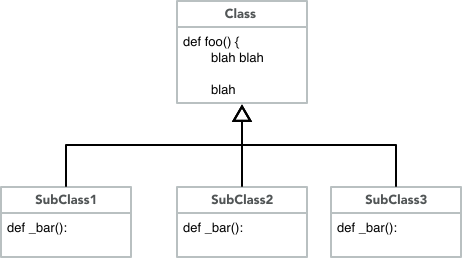
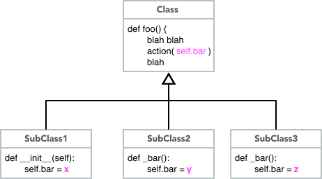
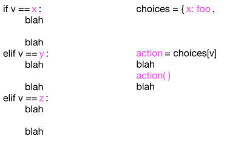

## DRYing out repetitive code 

A key feature of classes and objects is the 
ability to reduce repetitive code, following the 
DRY (Don't Repeat Yourself) principle.  If several 
related classes need an identical method, we prefer 
to write it once in a common superclass and inherit 
it into multiple subclasses.

Identical methods is the easy case.  What about 
*almost* identical methods, in which behavior of 
some method follows the same pattern in a group 
of related classes, but differs in some small, 
identifiable way?   

## Factor it

The first step in reducing redundancy is to identify 
exactly what is the same and what differs between 
methods with repetitive code.  Sometimes this is 
easy.  Often it is not.  We'll have more to say about 
that below. 

For the moment, we'll assume you have identified a 
pattern of common code and variation among several 
methods in subclasses of a common parent class. 

We'll look at two approaches to factoring the redundant 
method, and then at refactoring code in conditionals 
that may or may not appear in a method. 

## Factoring into a method 

Sometimes the variation among the redundant methods can 
be *factored out* into a separate method that can be 
called from the redundant methods. The variations can 
be coded as a new method in each of the subclasses, 
while the common code is inherited from a single method 
in the superclass: 

The inherited method appears only in the superclass 
and is inherited into each subclass, where it calls the appropriate factored method
in each subclass.  

## Refactoring into a variable 

When we refactor redundant code, we often look for ways
to move complexity from code to data.  Sometimes we can 
find a way to write the code just once by introducing one 
or more variables and using different variable values 
in each subclass.  Again the method can be written just 
once and inherited into each subclass, but each subclass 
sets the appropriate variable value(s): 

## Refactoring branching logic

Sometimes the redundant code, whether in a method or not, 
is in a chain of if/elif/elif/... branches, or something 
equivalent.  In this case, the particular code to
execute does not vary depending on the class, but rather 
depending on the value of a variable, but it may not be 
as simple as, for example, using that value in a calculation
or string.  In such a case, we may be able to replace 
the chain of if/elif/elif/... with a table lookup. 
In Python, we would typically implement such a table 
as a `dict`: 

In the diagram above, the redundant code has been 
refactored into three methods, `foo`, `bar`, and `zot`. 
In other cases, the table values might themselves be 
`dict` structures containing sets of variables, or 
complex objects, or keys to other tables.  

## The real trick is isolating variation

We've illustrated three ways to refactor code when 
you have identified exactly what is the same and 
what the variations are between different blocks of
code, either whole methods or branches in a 
complex branching structure.  The good news is that 
Python provides lots of ways to refactor with 
dynamic dispatch of methods and with tables.  The bad 
news is that the actual refactoring is the easy part. 
The hard part is recognizing and isolating the code 
to be refactored.  

Code can be beautiful.  One of the ways in which 
code can surprise us with its beauty is by being 
much simpler and more compact than we expected, 
because the programmer has seen
deep patterns that we didn't anticipate.  
Recognizing those patterns takes time and practice. 
Don't be frustrated if they elude you at first. 
But start practicing, and never stop. 