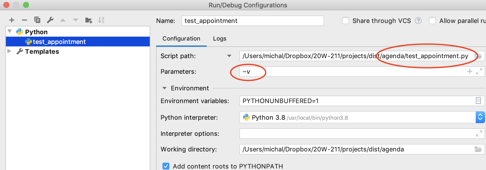

---
jupytext:
  formats: md:myst
  text_representation:
    extension: .myst
    format_name: myst
    format_version: 1.1
    jupytext_version: 1.10.3
kernelspec:
  display_name: Python 3
  language: python
  name: python3
---

# Running Python code in an IDE or at the command line

I presume you've already run Python programs either from the command
line or from the basic IDLE interactive development environment (IDE).
When we needed to specify an input file or other options to our running
program, we supplied the necessary information on the command line,
something like

```python
$ python3
my_program.py - pleasedontcrash
my_input.csv
 ```

The exact syntax, including the prompt (`$` in my example above), the
name of the Python interpreter (`python3` in my example), and the way
options are identified (with a leading `-` in my example) can depend on
your operating system and configuration.

While we are developing a program, we need to run our code or a test
script that exercises our code again and again to check progress and
catch new bugs as quickly as possible. If we have to type out the entire
command line each time we run it, we will be discouraged from running
the many incremental tests that are crucial for efficient development.
We'll be tempted to write or edit too much new code between test runs,
which sooner or later will leave us with a difficult debugging task that
could have been avoided.

Interactive development environments (IDEs) like PyCharm and VS Code
provide ways of running a program by pressing a button. The default "run
the code you're editing" action is sufficient if you don't need extra
arguments on the command line. When you do need extra arguments or other
adjustments to run your tests, these IDEs can be configured to
automatically provide those arguments and adjustments. They do so by
building a command line internally, and then executing it just as you
would in a terminal window.

Let's look first at the parts of a command line, then at how to
configure PyCharm or VS Code to build and execute the command line we
need when we push a "run" button.

## Python from the command line

When we run a Python program, we are actually running another program,
the Python _interpreter_, which translates our Python code into an
internal _byte code_ representation of instructions for an imaginary
Python computer (a _virtual machine_), then simulates execution of that
imaginary computer.  (We'll build our own simulator for a simpler
_virtual machine_  in the
[Duck Machine project](https://github.com/UO-CIS211/duck-stack).)

Because we're really running the Python interpreter, there are actually
two sets of command line arguments:  Arguments for the Python
interpreter, and arguments for our Python program.

```
$ python3 -pyarg1 program.py -our_arg1  input.txt
```

I the example above, `-pyarg1` is an argument to the Python
interpreter (which in the example is `python3` but might be `py` or
`python` depending on how Python is installed on your operating system).
`-our_arg1`, which appears _after_ the file name of our Python program,
is an argument to our Python program `program.py`.  `program.py` is
actually the input file for `python3`, and `input.txt` is the input file
for `program.py`.

When we configure PyCharm or VS Code to run test cases, there will be a
place to specify each of these. In PyCharm we'll place them in slots in
a form. In VS Code we'll code them textually in a `json` format file,
`launch.json`.

[Skip to VS Code configuration](
#configuring-the-run-button-in-vs-code)

## Configuring the run button in PyCharm

In PyCharm we create a _configuration_ using the _edit configurations_
menu selection


then add a new configuration for running a Python program. PyCharm will
offer several other options, including some specialized for testing. You
might find some of these useful later, but for now we want a
straightforward "Python" configuration whether we are running our Python
program or a test program for exercising our code.




The "name" field is how the run configuration will be identified in
PyCharm's title bar (in place of "run current file"). The "script path"
is where it should find the Python source code we want to run. The "
Parameters" field is for command line arguments to your Python program,
with a separate "interpreter" option for arguments to the Python
interpreter itself. There are additional settings you can alter, but
these should be enough for now.

If we add a `-v` option for a test program that uses the `unittest`
framework, as our `test_appt.py` program does,
we can see a list of the passing and failing
test cases before details of the (many) errors:

``` 
/usr/local/bin/python3.8 /Users/michal/Dropbox/20W-211/projects/dist/agenda/test_appt.py -v
test_00_equality (__main__.TestAppt) ... ok
test_01_order (__main__.TestAppt) ... ok
test_02_overlap (__main__.TestAppt) ... ERROR
test_03_intersect (__main__.TestAppt) ... ERROR
```

## Configuring the run button in VS Code

VS Code provides a way of configuring its "run and debug" button that is
conceptually similar to creating a run configuration in PyCharm, but
instead of a graphical interface form you will edit a text file
`launch.json` in Javascript Object Notation (JSON) format.

You can create or edit a `launch.json` document with run/debug button on
the left margin.  Choose the "create launch configuration" link and 
choose "Python Debugger" when asked to select a debugger. 


The `launch.json` configuration file will be created in a hidden folder
called `.vscode`. It describes a data structure that is a `list` of
`dicts`. Initially the list contains a single `dict` for a 
configuration that runs the
current file from the editor in a Python debugger.


We can edit this configuration or create a new one. Let's edit it with
essentially the same information we provided to PyCharm above.

```json
{
  "version": "0.2.0",
  "configurations": [
    {
      "name": "Unit tests for Appt class",
      "type": "python",
      "request": "launch",
      "program": "test_appt.py",
      "console": "integratedTerminal",
      "args": [
        "-v"
      ]
    }
  ]
}
```

The `program` element is the path to source code file (what PyCharm
called the `script`). Just as PyCharm offered many more specialized
configuration types, but we chose a plain "Python" configuration, here
we choose "python" as the `type`. The `-v` in the example will be an
argument provided to our Python program, in this case an option for the
`unittest` framework executed by `test_appt.py`.  
The `name` element is how this launch configuration will appear
when we press the run button.

After we have edited this launch configuration in
`.vscode/launch.json`, it is available to run from VS Code. Press 
the run/debug button (triangle with a insect), then in the "Run and 
Debug" line, choose the launch configuration name from the menu and 
press the green triangle. 


## Why was this necessary? 

You might be wondering why the configurations for running the 
project from PyCharm or VS Code were not provided in the project 
repository.   The project repository is where we keep artifacts that 
are the same for everyone who will work on that project.
Configurations are specific to the environment in which you will run 
your code, which includes at least your operating system and, in 
many cases, also the location of the project in your file system. 

In a research or professional development environment, each 
developer on the development team might have their own unique 
configuration files, and the team might in addition have multiple 
configurations for test servers and the production environment, 
whether that be on a server "in the cloud" or on a client's 
dedicated computers.  These configurations might be maintained in 
their own repositories and combined with project repositories in an 
automated build process.  The tools and processes to manage such a 
build process are overkill for a beginning course in computer science.  
You are likely to encounter them later in an internship, project 
course, or research project.

